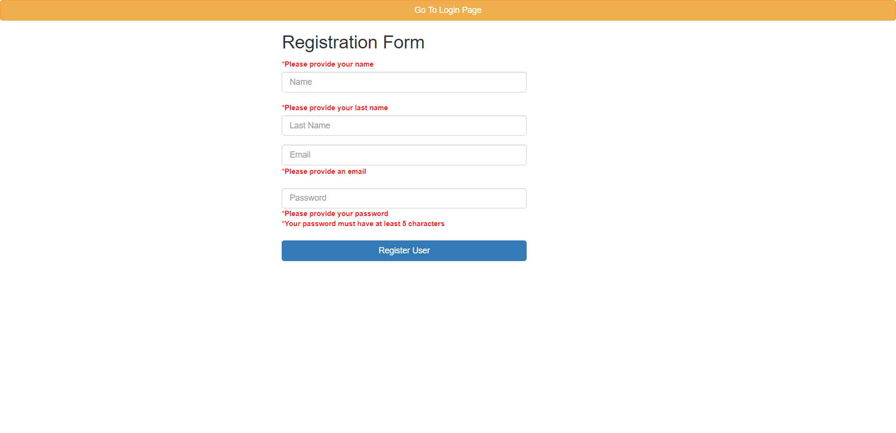

# SpringSecurity
Simple app for Spring Security learn purpose.

#### Stack
* Backend: REST API, Java 8, Spring Boot, Spring Security, H2, Lombok, Maven
* Frontend: Thymeleaf, HTML, Css

#### Features

- [x] User registration  
- [x] User login  
- [x] Validation for incorrect registration ang logging 
- [x] Logged in users are redirected to the appropriate content

#### Examples of some features





#### Build and run Java application (localhost:8080)

```sh
$ cd backend && mvn clean install
```
```sh
$ java -jar target/SpringSecurity-0.0.1-SNAPSHOT.jar
```


